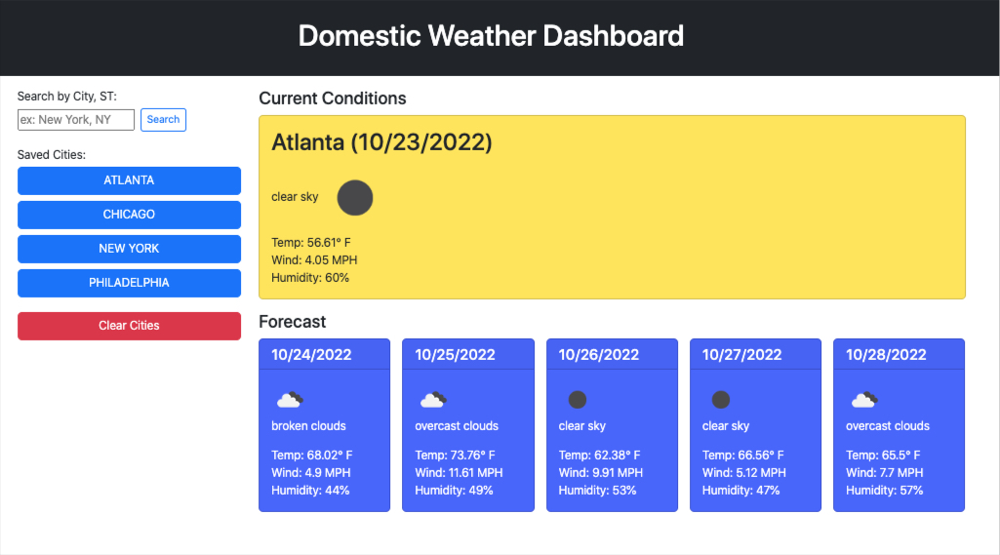

# Domestic Weather App

## Description

This is a simple weather app enabling a user planning a trip in the United States to check the weather in various cities at the time of use, plus a five day forecast.  The app saves the user's cities in localStorage and inserts buttons with those cities onto the page allowing the user to click among multiple cities to compare weather over several days.

This project offered me the opportunity to build an application using two APIs from [https://openweathermap.org](https://openweathermap.org), passing data from one to another and using the returned data to populate content on the page.  

## Installation & Usage
No installation is necessary to use this application, just visitint the URL and searching for a city.  I've set it up so that a user can enter just a city name, but to assure the correct city returns, the user can also include the two letter state in the search field (ex: Springfield, IL or Springfield, MA)

I learned...

This app can be used by visiting:
[https://mikewebprint.github.io/weather-app/](https://mikewebprint.github.io/weather-app/)

## Credits

I wrote the code for this project myself, of course with numerous Google searches for the correct syntax on various elements.  I did rely on [regexr.com](https://regexr.com) for the correct syntax on the city,state pattern to validate the input field.

---

## Features

This project is built in HTML, CSS, JS, and Photoshop (favicon), and uses Bootstrap, Openweatermap APIs, 

